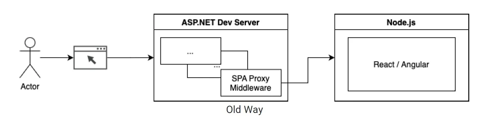
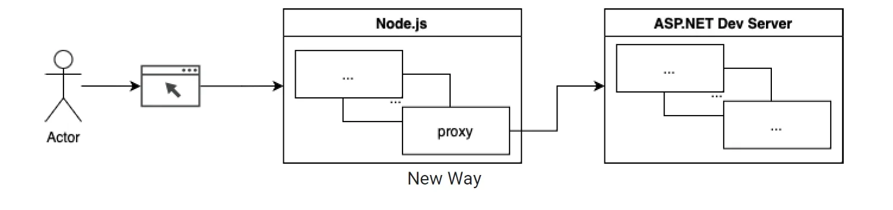

## Different ways to use React(Vite) SPA with ASP.NET

## 📋 To do:  

1.) React(vite) SPA hosted on Razor Page  
2.) Code clean up   
3.) Check deployment for issues  

[Spa Proxy](https://www.infoq.com/articles/dotnet-spa-templates-proxy/)

This approach meant that the launch code needed to be specific for each front-end framework, resulting in hard-to-maintain code for each front-end framework that the Microsoft team wanted to support.  

 

From .NET 6, the new templates for Angular and React switch how the front end and back end communicate. They use the front end’s proxy solutions to send the request to the back end. The popular front-end frameworks already have built-in support for development server proxying, but they must also be configured each specific to the used framework. The ASP.NET app still launches the front-end development server, but the request comes from that server.

Advantages of this new approach include:

    Simpler configuration in the back-end files
    The back end is more independent from the front-end framework but not completely separate as the launch command and URL are still specific
    No more framework-specific code in the back end’s Startup.cs or Program.cs files
    Extensible to other front-end frameworks not included in the templates

ViteProxy = uses front end proxy  
UseProxyToSpaDevelopment = front end is serve in the same port as ASP.NET Core  